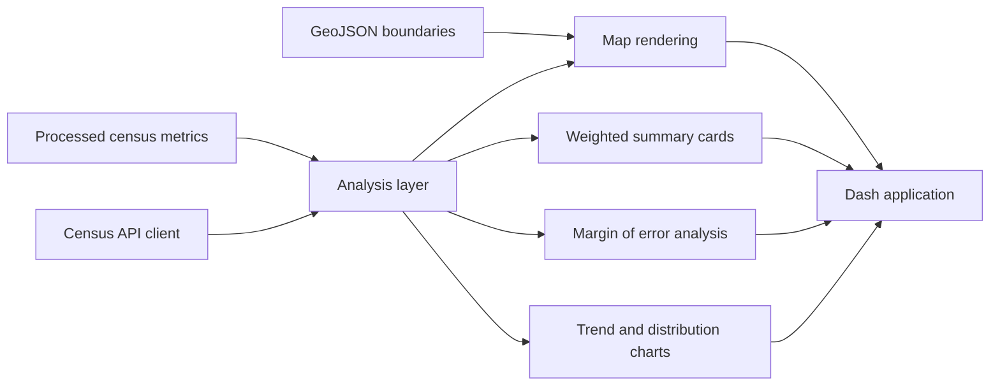

# Census Data Analytics and Visualization

This repository is a practical census analytics project focused on demographic exploration, survey-aware reporting, and geographic visualization. The brief behind it was intentionally narrow: process census-style data at meaningful scale, handle sampling-weight style thinking and margins of error correctly, and present the results through interactive dashboards that make demographic, income, and housing patterns easy to inspect by geography.

The implementation stays close to that scope. It does not try to be a full public-policy portal or a complete ACS warehousing system. Instead, it provides a clean local workflow for working with state and county level metrics, drawing choropleth maps, surfacing margin-of-error bands, and generating weighted summary views that mirror the kinds of questions analysts ask when they explore Census API data.

## What this project includes

- A Dash application for interactive demographic exploration
- State and county level choropleth maps with Plotly
- Weighted national summary cards
- Margin-of-error aware views for key metrics
- Trend and distribution charts for demographic storytelling
- A thin Census API client for real API-backed extension work
- Local sample datasets so the project runs without external credentials
- Smoke tests, unit tests, and a small benchmark harness
- Docker, CI, and a practical README

## README-backed scope

The original project description called for:

- analytics on US Census data
- interactive visualizations
- demographic trends
- geographic analysis
- handling large-scale census coverage and margin-of-error calculations
- choropleth maps at county, state, and national levels

Those requirements shaped the repository in three ways:

1. **Survey-aware metrics**
   The local analysis layer computes weighted summaries using population as the weighting column and exposes margin-of-error bounds for map and table views.

2. **Geographic drill-down**
   The dashboard can switch between state and county views for the same metric so the user can move from broad patterns to more localized inspection.

3. **Runnable without secrets**
   The Census API is represented through a real client class, but the demo experience uses local processed datasets. That keeps the repository easy to run and test while still leaving a clean path for live API-backed work.

## Tech stack

- Python
- Pandas
- Plotly
- Dash
- Census API integration surface
- Optional GeoJSON mapping support through local geometry files

## Repository layout

```text
census-data-analytics-visualization/
├── artifacts/
├── benchmarks/
│   └── benchmark_queries.py
├── data/
│   ├── processed/
│   │   ├── county_metrics.csv
│   │   └── state_metrics.csv
│   └── raw/
│       ├── counties.geojson
│       └── states.geojson
├── examples/
│   └── sample_query.json
├── scripts/
│   ├── run_demo.py
│   └── smoke_test.py
├── src/
│   └── censusviz/
│       ├── analysis.py
│       ├── app.py
│       ├── cli.py
│       ├── config.py
│       ├── data_loader.py
│       ├── fetch.py
│       └── visuals.py
├── tests/
├── .env.example
├── docker-compose.yml
├── Dockerfile
├── pyproject.toml
├── requirements.txt
└── README.md
```

## Core features

### 1. Weighted summary statistics

The summary layer computes national rollups from state-level data using population as weights. This keeps the output closer to how analysts think about national-level aggregates than a naive arithmetic mean.

### 2. Margin-of-error aware reporting

Each core metric includes a paired margin-of-error column. The UI uses that to render an uncertainty chart so the user can inspect estimate stability instead of looking at point estimates alone.

### 3. Geographic analysis by state and county

The mapping layer supports state and county choropleths from the same control surface. The sample geometry is intentionally lightweight so the repository remains runnable in a local development environment.

### 4. Trend and distribution storytelling

The dashboard includes regional trend lines and income distribution views so the project is not just a static map renderer.

### 5. API extension path

The `CensusAPIClient` class is a small but real integration layer around the Census API URL format. The repository uses local data by default, but the client makes it straightforward to extend the project into a live fetch pipeline.

## Architecture



## Data notes

The sample data represents a curated subset of state and county metrics to keep the project lightweight while still showing the intended workflow. Included measures are:

- population
- median income
- poverty rate
- owner-occupied housing rate
- median home value
- median age

Each measure includes a simple margin-of-error companion column where appropriate.

## Local setup

### Option 1: install and run locally

```bash
python -m venv .venv
source .venv/bin/activate
pip install -e .[dev]
python scripts/smoke_test.py
python scripts/run_demo.py
python -m censusviz.app
```

The Dash app runs on `http://localhost:8050`.

### Option 2: Docker

```bash
docker compose up --build
```

## Sample commands

```bash
pytest
python scripts/smoke_test.py
python scripts/run_demo.py
python benchmarks/benchmark_queries.py
python -m censusviz.cli summary
python -m censusviz.cli top --metric median_income --geography county --limit 5
```

## Output artifacts

The demo script writes `artifacts/demo_report.json` with:

- a weighted national summary
- top states by median income
- top counties by home value

The benchmark script writes `artifacts/benchmark_results.txt`.

## Visualization notes

### Choropleths

The map layer uses Plotly choropleths with lightweight GeoJSON included in the repository. For a full production build you would normally use official TIGER or Census cartographic boundaries, but for a small GitHub-ready project the simplified geometry is easier to move around and test.

### Margin-of-error chart

The error-bar chart is deliberately explicit. Public data work is often presented with too much certainty, so this repository keeps the uncertainty visible in the dashboard.

### Trends and distribution

The line chart and bar chart are there to show that the platform is more than a map. Analysts often need both spatial and non-spatial views in the same workflow.

## Design decisions

### Local-first data pipeline

Live Census API pulls are useful, but they make tests and demos brittle. The local-first design keeps the default path fast and reproducible.

### Thin API wrapper instead of a full ingestion job

The README called for Census API usage, not a full warehousing stack. The current client is enough to show the integration surface without pulling the build away from its core analytics purpose.

### Lightweight geometry for portability

A full county shapefile workflow would add more dependencies and slow down the repo. The included GeoJSON is intentionally compact so the repository stays easy to clone, inspect, and run.

## Testing

Run the full test suite with:

```bash
pytest
```

The tests cover:

- weighted summary behavior
- ordering of top geography outputs
- margin-of-error bounds
- Census API URL construction

## Benchmarking

The benchmark script measures a few common query paths:

- weighted national summary
- top-state ranking by income
- county margin-of-error frame generation

Run it with:

```bash
python benchmarks/benchmark_queries.py
```

## License

MIT
