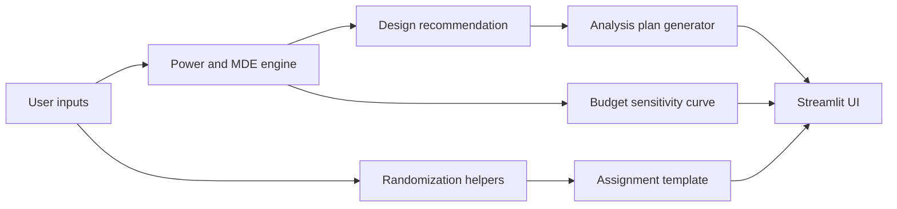

# Experimental Design and Power Analysis Tool

A practical planning tool for experiments that need more than a back-of-the-envelope sample size guess. This project helps with three planning problems that come up repeatedly in product analytics, experimentation, and operational rollouts:

1. How many observations do we need to detect a realistic effect?
2. How should we allocate traffic when treatment and control have different costs?
3. What randomization and analysis plan should we commit to before launch?

The build is based on a lightweight spec: support between-subject, within-subject, and clustered experiments; compute power and minimum detectable effects; recommend cost-aware treatment allocation; and provide an interactive planning interface. The implementation stays close to that brief and avoids drifting into a full experimentation platform.

## What the repository includes

- A Python library for sample size, power, and MDE calculations
- Cost-aware treatment allocation using a Neyman-style rule when group costs differ
- Planning support for:
  - between-subject designs
  - within-subject or paired designs
  - clustered rollouts with intraclass correlation inflation
- Randomization helpers for complete, blocked, and cluster assignment
- A prespecified analysis-plan generator for common experiment setups
- A Streamlit app for interactive planning
- Plotly-based budget sensitivity charts
- Tests, smoke scripts, and a small benchmark harness
- Docker and CI scaffolding

## Tech stack

- Python
- statsmodels
- SciPy
- Streamlit
- Plotly

## Repository layout

```text
experimental-design-power-analysis-tool/
├── artifacts/
├── benchmarks/
│   └── benchmark_calculations.py
├── examples/
│   └── demo_subjects.csv
├── scripts/
│   ├── run_demo.py
│   └── smoke_test.py
├── src/
│   └── expower/
│       ├── analysis_plan.py
│       ├── app.py
│       ├── cli.py
│       ├── power.py
│       └── randomization.py
├── tests/
├── .env.example
├── docker-compose.yml
├── Dockerfile
├── pyproject.toml
├── requirements.txt
└── README.md
```

## Core design choices

### 1. Between-subject calculations are the default

Many practical A/B tests still start from a treatment-control split with either a continuous outcome or a conversion-style binary outcome. The code supports both and returns:

- required total sample size
- treatment and control counts
- estimated cost
- treatment-control ratio
- budget-implied MDE

### 2. Cost matters

The README called out optimal allocation under budget constraints, so the library does not assume a fixed 50/50 split. When treatment units are more expensive than control units, the recommendation shifts traffic toward the cheaper arm while trying to preserve power.

### 3. Clustered experiments are first-class

Rollouts often happen by store, school, clinic, or market. The clustered path inflates the individual-level sample requirement with a design effect based on average cluster size and ICC, and then translates the result back into approximate cluster counts.

### 4. The UI is only a thin surface over the statistical core

The Streamlit app is intentionally lightweight. The planning logic lives in the library so it can be tested from Python, reused in notebooks, and called from scripts without depending on a web session.

## Architecture



## Statistical scope

### Supported design types

#### Between-subjects
- continuous outcome
- binary outcome
- configurable alpha and target power
- cost-aware allocation
- budget-implied minimum detectable effect

#### Within-subjects
- paired t-test based sample sizing
- budget-aware MDE backsolve

#### Clustered
- design effect inflation
- ICC input
- average cluster size input
- approximate cluster counts by arm

## Randomization helpers

The repository includes three assignment utilities:

- `complete_randomization`
- `blocked_randomization`
- `cluster_randomization`

These are meant for planning and simulation. They are not a substitute for production enrollment infrastructure, but they are useful for generating assignment templates, reviewing balance, and testing analysis code before launch.

## Analysis-plan generator

The analysis-plan module returns a prespecified template that includes:

- estimand
- recommended primary statistical test
- covariate adjustment guidance
- randomization recommendation
- planning notes around stopping rules, attrition, and ratio mismatch

This keeps the project grounded in experimental design rather than treating power analysis as a disconnected formula exercise.

## Local setup

### Option 1: library and scripts

```bash
python -m venv .venv
source .venv/bin/activate
pip install -e .[dev]
python scripts/smoke_test.py
python scripts/run_demo.py
```

The demo writes `artifacts/demo_report.json`.

### Option 2: Streamlit app

```bash
pip install -r requirements.txt
export PYTHONPATH=src
streamlit run src/expower/app.py
```

### Option 3: Docker

```bash
docker compose up --build
```

Then open `http://localhost:8501`.

## Example usage

### Power recommendation in Python

```python
from expower.power import TwoSampleDesignInputs, recommend_two_sample_design

recommendation = recommend_two_sample_design(
    TwoSampleDesignInputs(
        outcome_type="continuous",
        alpha=0.05,
        power=0.8,
        effect_size=0.3,
        treatment_cost=1.5,
        control_cost=1.0,
        budget=2500,
    )
)

print(recommendation.to_dict())
```

### Blocked randomization

```python
import pandas as pd
from expower.randomization import blocked_randomization

subjects = pd.DataFrame(
    {
        "subject_id": ["s1", "s2", "s3", "s4"],
        "country": ["US", "US", "CA", "CA"],
    }
)

assignments = blocked_randomization(subjects, block_column="country")
print(assignments)
```

## Sample commands

```bash
pytest
python benchmarks/benchmark_calculations.py
python scripts/smoke_test.py
python scripts/run_demo.py
```

## Outputs and artifacts

Running the demo script produces a JSON report with:

- between-subject recommendation
- paired-design recommendation
- clustered-design recommendation
- a canned analysis plan
- a budget sensitivity curve

That output is intentionally simple and easy to inspect in version control.

## Testing

The test suite covers:

- sample-size recommendation shape and monotonic behavior
- cluster inflation relative to a non-clustered design
- randomization helper correctness
- analysis-plan generation

Run:

```bash
pytest
```

## Benchmarking

The benchmark script times the main calculation paths across repeated runs.

```bash
python benchmarks/benchmark_calculations.py
```

This is not a micro-optimization contest. The goal is to confirm that planning calculations remain effectively instant in a local workflow.

## Docker and deployment notes

The project ships with a minimal Dockerfile and `docker-compose.yml` for local deployment. There is no heavy production infrastructure because the original brief did not call for a multi-service platform. If this were deployed internally, the natural next step would be running the Streamlit app behind an authenticated reverse proxy and persisting saved scenarios in a small relational store.

## Observability notes

The scope here is intentionally smaller than a service platform. Instead of adding synthetic infrastructure, observability is kept to:

- smoke test execution
- benchmark script output
- deterministic demo artifacts

That keeps the repo honest to the stated project while still making it easy to validate.

## Tradeoffs

- Binary-outcome sizing uses a standardized effect-size bridge for simplicity rather than a very large menu of bespoke proportion-test variants.
- Clustered calculations rely on design-effect inflation, which is the right planning approximation for many settings, but not a replacement for a full mixed-model simulation study.
- The Streamlit layer is intentionally lightweight and not coupled to persistence.

## Limitations

- No sequential-testing engine
- No CUPED variance model estimation from historical data
- No production user management or saved scenario storage
- No Bayesian power or decision-theoretic planning
- No exact randomization inference workflow

## Reproducibility

The calculations are deterministic. Randomization helpers take explicit seeds, tests run against fixed examples, and the demo script writes a predictable JSON artifact. That makes the repo easy to inspect, rerun, and adapt.
